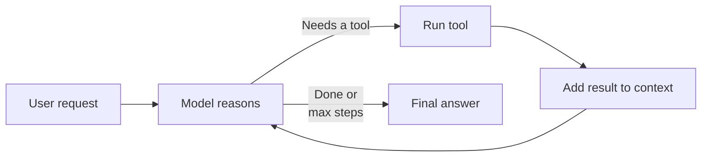
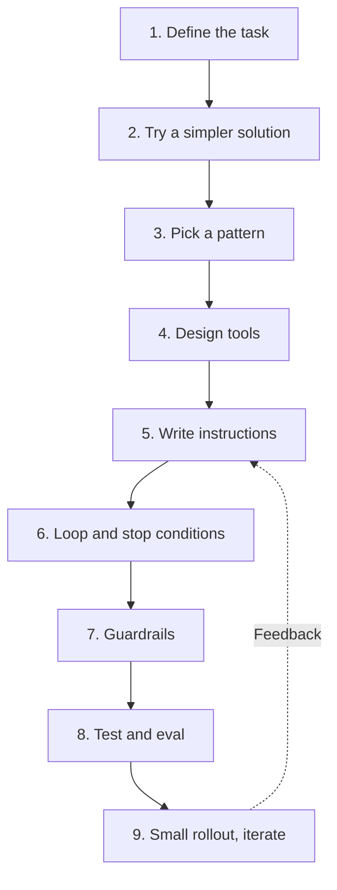

# Building an AI Agent: A Beginner's Process Guide

Sep 23, 2026 · @Nazmul

## 1. What an agent is, and when to build one

An AI agent is a system where a language model (LLM) decides for itself which tools to use and how to finish a task. The core rule: start with the simplest solution, and add complexity only when needed. ([Anthropic](https://www.anthropic.com/engineering/building-effective-agents))

**Workflow vs agent** — both are "agentic systems"; the difference is who holds control:

| Aspect | Workflow | Agent |
| --- | --- | --- |
| Who decides the steps | Your code, a predefined path | The model, at runtime |
| Predictability | High | Lower |
| Cost and latency | Lower | Higher (many model calls) |
| Best fit | Well-defined, repeatable steps | Open-ended, step count unknown upfront |
| Example | Write copy → translate it | Fix code across many files |

**When not to build an agent:** when the task always follows the same steps, or a good prompt with a few examples solves it in one model call. Agents trade cost and latency for better results; that trade is not always worth it.

**When an agent fits:** when decisions must be made at runtime — which tool is needed, what information is missing, how to adjust the plan after a tool result. Customer support and coding are good examples, because success is measurable and feedback is available.

## 2. Core components of an agent

Every agent is built from three things — a model, tools and instructions — running inside a loop. ([OpenAI](https://openai.com/business/guides-and-resources/a-practical-guide-to-building-ai-agents/))

| Component | Role | Beginner tip |
| --- | --- | --- |
| Model (LLM) | Reasoning and decision-making | Set a baseline with the most capable model first, then try smaller, cheaper ones |
| Tools | Acting on the outside world (APIs, databases, search, files) | Give each tool a clear name, parameters and description |
| Instructions (system prompt) | What to do, how, and what to do when things go wrong | Write in steps and cover edge cases |
| Memory / context | Past conversation, tool results, needed facts | Keep only what matters; drop the rest |
| Guardrails | Safety and boundaries | From day one, keep at least a max step count and approval for risky actions |

**Three kinds of tools:** data tools (fetch information, e.g. database lookup or web search), action tools (change something, e.g. send an email or update a record), and orchestration tools (call another agent as a tool).

**The agent loop** — an agent is essentially a `while` loop: the model thinks → calls a tool → sees the result → thinks again, until a stop condition is met.



At each step the agent gets "ground truth" from the environment (tool output, code execution results) to check its progress. Common stop conditions: a reply with no tool call, a specific output, an error, or hitting the max step count.

## 3. Step-by-step build process

Starting small and growing step by step is the path to a successful agent. The nine steps below are a safe order for a first agent.



1. **Define the task clearly.** Write down the inputs, allowed actions, expected output, failure conditions, and how success is measured.
   - Weak: "Help customers."
   - Strong: "Given a support ticket, classify the issue, find the relevant policy, draft a reply, and escalate to a human if unsure."
2. **Try a simpler solution first.** See whether one model call with a good prompt and a few examples does the job. Move on only if it doesn't.
3. **Pick the simplest pattern.** Known steps → a workflow; unknown steps → a single agent. Multi-agent is the last resort (see section 4).
4. **Design tools.** Two to five tools are enough to start. Each should have a distinct, clear job (section 5).
5. **Write instructions.** Turn your organization's existing SOPs or policies into step-by-step routines. Tie every step to a specific action and cover edge cases (e.g. what to do if information is incomplete).
6. **Set the loop and stop conditions.** Define a max step count (e.g. 10–20), a timeout, and what happens on errors.
7. **Add guardrails.** Human approval on risky tools, input validation, personal-data filtering (section 6).
8. **Test and evaluate.** Build a test set of 20–50 real examples and rerun it after every change (section 7).
9. **Roll out small, then improve.** Start with a few users or an internal team, read the logs, add failures to the test set, then expand.

**Rule for choosing a model:** hit your accuracy target with the most capable model first, then swap in smaller models where possible to cut cost and latency. ([OpenAI](https://openai.com/business/guides-and-resources/a-practical-guide-to-building-ai-agents/))

## 4. Common design patterns

Most real systems are built from a few simple, composable patterns; complex frameworks aren't required. Complexity grows from top to bottom — go only as far down as you must. ([Anthropic](https://www.anthropic.com/engineering/building-effective-agents))

| Pattern | How it works | When to use | Example |
| --- | --- | --- | --- |
| Prompt chaining | Output of one call feeds the next; code checks in between | Task splits cleanly into fixed steps | Outline → check → full draft |
| Routing | Classifies input and sends it to a specialized prompt/model | Distinct categories exist | General questions, refunds, tech support on separate paths |
| Parallelization | Several calls at once; results merged or voted on | Need speed or multiple perspectives | One call answers, another screens for safety |
| Orchestrator-workers | A central model splits work among workers, then combines | Subtasks can't be predicted upfront | Code changes across many files |
| Evaluator-optimizer | One model generates, another evaluates and gives feedback, in a loop | Clear evaluation criteria | Refining a literary translation |
| Autonomous agent | Model picks tools itself and works in a loop | Step count can't be predicted | Coding agents, customer support |

**When to go multi-agent?** Max out a single agent first. Signs it's time to split: the prompt is full of if-else conditions, or overlapping tools make the agent keep picking the wrong one. Two common shapes: the manager pattern (a central agent calls others as tools) and the handoff pattern (one agent fully hands the task to another). ([OpenAI](https://openai.com/business/guides-and-resources/a-practical-guide-to-building-ai-agents/))

## 5. Tool and context design

An agent is only as good as its tools. While building its SWE-bench agent, Anthropic spent more time improving tools than the main prompt. ([Anthropic: writing tools](https://www.anthropic.com/engineering/writing-tools-for-agents))

**Tool design rules**

- **Build fewer, more useful tools.** Don't wrap every API endpoint as its own tool. For example, build `search_contacts` rather than `list_contacts` (which returns everything).
- **Combine multi-step work into one tool.** One `schedule_event` instead of `list_users` + `list_events` + `create_event`.
- **Use clear names and namespaces.** Prefix by service, e.g. `asana_search`, `jira_search`. Keep parameter names unambiguous: `user_id`, not `user`.
- **Write descriptions as if briefing a new teammate.** Include examples, limits, input formats, and how it differs from other tools.
- **Make mistakes hard (poka-yoke).** For example, requiring absolute file paths instead of relative ones stopped the model making path errors.
- **Return meaningful results.** Prefer human-readable fields like `name` and `file_type` over technical IDs like `uuid` or `mime_type`.
- **Save tokens.** Use pagination, filtering or truncation for large results.
- **Keep error messages helpful.** Not just an error code — say what went wrong and what correct input looks like.

**Context engineering** — as an agent loops, information piles up, but the model's context window is limited. Choosing what the model sees at each step is context engineering, the next step beyond prompt engineering. ([Anthropic: context engineering](https://www.anthropic.com/engineering/effective-context-engineering-for-ai-agents)) Practical techniques: summarize old tool results, write progress to a notes file on long tasks, and fetch information when needed rather than loading everything upfront.

**What is MCP (Model Context Protocol)?** An open standard: build a tool server once, and many agents and apps can use it. For beginners: first pass tools directly to the API as functions; convert them to an MCP server once the same tools are needed in several places. ([MCP docs](https://modelcontextprotocol.io/docs/getting-started/intro))

## 6. Safety and guardrails

One guardrail is not enough; layering several makes an agent safer. Alongside guardrails you still need standard software security (authentication, access control). ([OpenAI](https://openai.com/business/guides-and-resources/a-practical-guide-to-building-ai-agents/))

| Guardrail | What it does | Simple example |
| --- | --- | --- |
| Relevance check | Flags off-topic requests | A refund agent politely declines to write a poem |
| Safety classifier | Catches jailbreaks and prompt injection | Blocks input like "ignore all previous instructions" |
| Personal data (PII) filter | Stops unnecessary personal data in output | Masks phone numbers and national ID numbers |
| Rules-based protection | Blocklists, input length limits, regex | Blocks SQL injection patterns |
| Tool risk rating | Rates each tool low/medium/high risk | Read-only = low; sending money = high, needs human approval |
| Output validation | Checks replies against policy and brand | A second model reviews before sending |

**A warning about prompt injection:** text inside web pages, emails or files is "data" to the agent, not instructions. State clearly in the instructions that the agent must not act on instructions hidden in outside content, and always require approval for sensitive actions.

**Least privilege:** give the agent only the access the task needs. Start with read-only tools and add write tools as trust grows. Test in a sandbox.

**Human-in-the-loop** — make it mandatory in two cases:

- **When failure limits are exceeded** — e.g. escalate to a human after repeatedly failing to understand the user's intent.
- **For high-risk actions** — cancelling orders, large refunds, payments, deleting data, sending emails.

**Order for building guardrails:** data privacy and content safety first, then new guardrails based on real failures, and finally balancing security with user experience.

## 7. Testing, evals and monitoring

Improving an agent without evals is walking in the dark: fix one thing, break another, and nobody notices. You don't need hundreds of tests to start — 20–50 simple tasks drawn from real failures is a good start. ([Anthropic: evals](https://www.anthropic.com/engineering/demystifying-evals-for-ai-agents))

**Key terms**

- **Task** — one test: defined inputs and success criteria.
- **Trial** — one run of a task. Model outputs vary each run, so run several.
- **Grader** — the logic that scores the result.
- **Transcript** — the full record of a run: every tool call, reasoning step and result.
- **Outcome** — the real state of the environment at the end. The agent may say "booked", but the real question is whether the booking exists in the database.

**Three kinds of graders**

| Grader | Method | Strengths | Weaknesses |
| --- | --- | --- | --- |
| Code-based | String match, unit tests, database state checks | Fast, cheap, reliable | Can reject correct answers phrased differently |
| Model-based (LLM judge) | Another model scores with a rubric | Flexible, catches nuance | Costlier; needs calibration against humans |
| Human | Expert review, spot checks | Most accurate | Slow and expensive |

**Steps to build evals as a beginner**

1. Turn what you already test by hand into your first tasks. Turn user complaints into tasks too.
2. Write unambiguous tasks — two experts should reach the same pass/fail verdict.
3. Test both directions: when the agent should do something, and when it shouldn't (e.g. when to search and when not to).
4. Start each trial from a clean environment.
5. Grade what the agent produced more than the path it took; give partial credit for partial success.
6. Read transcripts regularly — that's how you tell an agent mistake from a grader mistake.

**Keep two kinds of evals:** capability evals (hard tasks, low pass rate, a hill to climb) and regression evals (should pass near 100%, alert you when something breaks).

**Monitor after launch:** log token usage, time, number of tool calls and error rate per task. Review user feedback (e.g. thumbs-down) regularly and read some transcripts every week. Tools like LangSmith, Langfuse, Braintrust or Arize Phoenix help with this.

## 8. Common beginner mistakes and checklist

Most failed agent projects fail not because of the model, but because of excess complexity, vague tools and lack of testing.

| Common mistake | Why it hurts | Fix |
| --- | --- | --- |
| A multi-agent system on day one | Hard to debug, costly | Start with one agent, split only if needed |
| Not understanding what the framework does inside | Prompts and responses are hidden; bugs are hard to find | Build it first in a few lines with the raw API |
| Every API endpoint as a separate tool | Model gets confused, context is wasted | A few task-focused tools |
| Vague tool descriptions | Wrong tool or wrong parameters | Detailed descriptions with examples |
| No max step limit | Infinite loops, runaway bills | `max_steps` and a timeout |
| Write access to production data | Irreversible damage | Read-only tools, sandbox, approvals |
| Changing things without evals | You don't know what broke | A 20–50 task test set |
| No logging | Impossible to trace failures | Log every tool call and reply |

**Pre-launch checklist**

- [ ] Task definition written: inputs, allowed actions, output, success criteria
- [ ] Confirmed a single model call or simple workflow can't do the job
- [ ] Every tool has a clear name, description and helpful error messages
- [ ] System prompt covers steps, edge cases and when to stop
- [ ] Max step count and timeout set
- [ ] Human approval on high-risk tools
- [ ] API keys and secrets in environment variables, not in code
- [ ] Ran an eval set of at least 20 tasks
- [ ] Logging and cost monitoring enabled
- [ ] A path to hand off to a human on failure

## 9. Hands-on example: a simple agent

You can build a working agent in about 50 lines without any framework. The example below is an "order assistant" with two tools: checking order status (low risk) and starting a refund (high risk, so it needs human approval).

**Setup:** install Python 3.9+, run `pip install anthropic`, and put your API key in the `ANTHROPIC_API_KEY` environment variable.

```python
import anthropic

client = anthropic.Anthropic()  # reads the key from ANTHROPIC_API_KEY
MAX_STEPS = 10                  # prevents infinite loops

# 1. Tool definitions: clear names, descriptions and parameters
TOOLS = [
    {
        "name": "get_order_status",
        "description": "Returns the current status and delivery date of an order. "
                       "Order IDs start with 'ORD-', e.g. ORD-1024.",
        "input_schema": {
            "type": "object",
            "properties": {"order_id": {"type": "string", "description": "e.g. ORD-1024"}},
            "required": ["order_id"],
        },
    },
    {
        "name": "request_refund",
        "description": "Starts a refund for an order. Only call when the customer has explicitly asked for a refund.",
        "input_schema": {
            "type": "object",
            "properties": {
                "order_id": {"type": "string"},
                "reason": {"type": "string", "description": "The reason the customer gave"},
            },
            "required": ["order_id", "reason"],
        },
    },
]

# 2. What the tools actually do (fake data here; your database/API in practice)
ORDERS = {"ORD-1024": {"status": "in transit", "eta": "25 September"}}

def run_tool(name, args):
    if name == "get_order_status":
        order = ORDERS.get(args["order_id"])
        if not order:
            return "Error: no order with this ID. Ask the customer for the correct ID (ORD-xxxx)."
        return f"Status: {order['status']}, expected delivery: {order['eta']}"
    if name == "request_refund":
        # High risk: human approval (human-in-the-loop)
        ok = input(f"Approve refund? {args} (y/n): ")
        return "Refund started." if ok == "y" else "Refund not approved; tell the customer a staff member will contact them."
    return f"Error: no tool named '{name}'."

# 3. System prompt: role, steps, boundaries
SYSTEM = """You are an order assistant for an online shop. Reply politely.
1. For order questions, check get_order_status first; never guess.
2. If there is no order ID, ask the customer for it.
3. For anything unrelated to orders, say you can only help with orders."""

# 4. The agent loop
def run_agent(user_message):
    messages = [{"role": "user", "content": user_message}]
    for step in range(MAX_STEPS):
        response = client.messages.create(
            model="claude-sonnet-5",
            max_tokens=1024,
            system=SYSTEM,
            tools=TOOLS,
            messages=messages,
        )
        messages.append({"role": "assistant", "content": response.content})

        if response.stop_reason != "tool_use":  # no tool needed = done
            return "".join(b.text for b in response.content if b.type == "text")

        results = []
        for block in response.content:
            if block.type == "tool_use":
                print(f"[log] tool: {block.name} {block.input}")  # log for transparency
                results.append({
                    "type": "tool_result",
                    "tool_use_id": block.id,
                    "content": run_tool(block.name, block.input),
                })
        messages.append({"role": "user", "content": results})
    return "Sorry, I couldn't finish this. A staff member will contact you."

print(run_agent("Where is my order ORD-1024?"))
```

**How the code works:** the model first decides to call `get_order_status`, the code runs the tool and returns the result, and the model reads it and writes a reply. When no more tools are needed the loop stops; after 10 steps it hands off to a human.

**Try next:** add another tool (e.g. changing the delivery address), build a small test file of 10 questions and run it each time, and check that the agent correctly declines non-order questions.

## 10. Frameworks and further resources

Build with the raw API first (as in section 9) and understand the loop yourself; adopt a framework later if needed. Frameworks make starting easier but can hide the underlying prompts and responses, making debugging harder. ([Anthropic](https://www.anthropic.com/engineering/building-effective-agents))

| Tool / framework | Type | Good for |
| --- | --- | --- |
| Raw LLM API (Anthropic, OpenAI, etc.) | Code | Learning and first prototypes; full control |
| [Claude Agent SDK](https://platform.claude.com/docs/en/agent-sdk/overview) | Code (Python/TypeScript) | Claude Code-style agents with files, tools and sub-agents |
| [OpenAI Agents SDK](https://openai.com/business/guides-and-resources/a-practical-guide-to-building-ai-agents/) | Code (Python) | Multi-agent with handoffs and built-in guardrails |
| [Strands Agents SDK (AWS)](https://strandsagents.com/latest/) | Code | Agents in AWS environments |
| LangGraph / LangChain | Code, graph-based | When you want steps and branches drawn explicitly as a graph |
| [Rivet](https://rivet.ironcladapp.com/), [Vellum](https://www.vellum.ai/) | Visual / drag-and-drop | Building and testing workflows with little code |
| [MCP](https://modelcontextprotocol.io/docs/getting-started/intro) | Tool-connection standard | Reusing the same tools across agents and apps |

**Suggested learning order:** Python basics → one LLM API call → tool use → the agent loop from section 9 → a small eval set → one framework → building an MCP server.

**Sources (pages read)**

- [Building effective agents — Anthropic](https://www.anthropic.com/engineering/building-effective-agents)
- [A practical guide to building agents — OpenAI](https://openai.com/business/guides-and-resources/a-practical-guide-to-building-ai-agents/)
- [Writing effective tools for agents — Anthropic](https://www.anthropic.com/engineering/writing-tools-for-agents)
- [Demystifying evals for AI agents — Anthropic](https://www.anthropic.com/engineering/demystifying-evals-for-ai-agents)
- [Effective context engineering for AI agents — Anthropic](https://www.anthropic.com/engineering/effective-context-engineering-for-ai-agents)
- [Agent patterns cookbook — Anthropic](https://platform.claude.com/cookbook/patterns-agents-basic-workflows)
