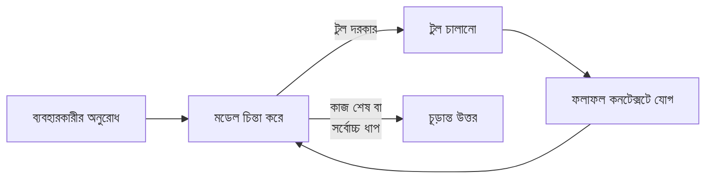
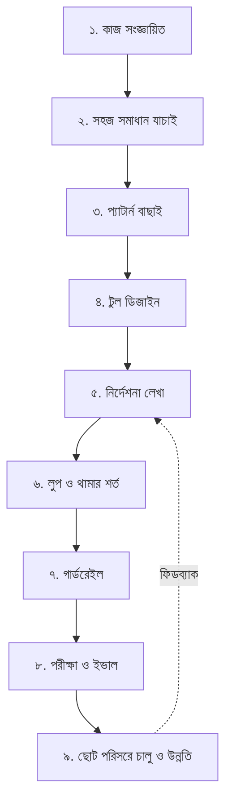

# এআই এজেন্ট তৈরির প্রক্রিয়া: নতুনদের জন্য গাইড

Sep 23, 2026 · @Nazmul
## ১. এজেন্ট কী, আর কখন বানাবেন

এআই এজেন্ট হলো এমন একটি সিস্টেম যেখানে একটি ভাষা মডেল (LLM) নিজেই ঠিক করে কোন টুল কখন ব্যবহার করবে এবং কাজটা কীভাবে শেষ করবে। মূল নিয়ম একটাই: সবচেয়ে সহজ সমাধান দিয়ে শুরু করুন, দরকার হলে তবেই জটিলতা বাড়ান। ([Anthropic](https://www.anthropic.com/engineering/building-effective-agents))

**ওয়ার্কফ্লো বনাম এজেন্ট** — দুটোই "এজেন্টিক সিস্টেম", কিন্তু নিয়ন্ত্রণ কার হাতে সেটাই পার্থক্য:

| বিষয় | ওয়ার্কফ্লো | এজেন্ট |
| --- | --- | --- |
| ধাপ কে ঠিক করে | আপনার লেখা কোড, আগে থেকে নির্দিষ্ট পথ | মডেল নিজে, চলার সময় |
| পূর্বানুমানযোগ্যতা | বেশি | কম |
| খরচ ও সময় | কম | বেশি (অনেকবার মডেল কল) |
| উপযুক্ত কাজ | সুনির্দিষ্ট, বারবার একই ধাপ | খোলামেলা, ধাপের সংখ্যা আগে জানা যায় না |
| উদাহরণ | লেখা তৈরি → অনুবাদ | একাধিক ফাইলে কোড ঠিক করা |

**কখন এজেন্ট বানাবেন না:** কাজটা যদি সবসময় একই ধাপে হয়, অথবা একটি ভালো প্রম্পট আর কিছু উদাহরণ দিয়েই একবারের মডেল কলে হয়ে যায়। এজেন্ট বেশি খরচ ও দেরির বিনিময়ে ভালো ফল দেয়; সেই বিনিময় সবসময় লাভজনক নয়।

**কখন এজেন্ট উপযুক্ত:** যখন চলার সময়ই সিদ্ধান্ত নিতে হয় — কোন টুল লাগবে, কোন তথ্য বাকি, টুলের ফল দেখে পরিকল্পনা বদলানো। ভালো উদাহরণ কাস্টমার সাপোর্ট আর কোডিং, কারণ সেখানে সফলতা মাপা যায় এবং ফিডব্যাক পাওয়া যায়।

## ২. এজেন্টের মূল উপাদান

প্রতিটি এজেন্ট মূলত তিনটি জিনিস দিয়ে তৈরি — মডেল, টুল আর নির্দেশনা — যেগুলো একটি লুপের ভেতরে চলে। ([OpenAI](https://openai.com/business/guides-and-resources/a-practical-guide-to-building-ai-agents/))

| উপাদান | কাজ | নতুনদের জন্য পরামর্শ |
| --- | --- | --- |
| মডেল (LLM) | চিন্তা করা ও সিদ্ধান্ত নেওয়া | প্রথমে সবচেয়ে সক্ষম মডেল দিয়ে বেসলাইন তৈরি করুন, পরে ছোট ও সস্তা মডেল পরীক্ষা করুন |
| টুল | বাইরের জগতের সাথে কাজ (API, ডাটাবেস, সার্চ, ফাইল) | প্রতিটি টুলের স্পষ্ট নাম, প্যারামিটার ও বিবরণ দিন |
| নির্দেশনা (সিস্টেম প্রম্পট) | কী করবে, কীভাবে করবে, সমস্যা হলে কী করবে | ধাপে ধাপে লিখুন, এজ-কেস উল্লেখ করুন |
| মেমরি / কনটেক্সট | আগের কথোপকথন, টুলের ফল, প্রয়োজনীয় তথ্য | শুধু দরকারি তথ্য রাখুন, অপ্রয়োজনীয় জিনিস বাদ দিন |
| গার্ডরেইল | নিরাপত্তা ও সীমানা | শুরু থেকেই অন্তত সর্বোচ্চ লুপ সংখ্যা ও ঝুঁকিপূর্ণ কাজে অনুমোদন রাখুন |

**টুলের তিন ধরন:** ডেটা টুল (তথ্য আনা, যেমন ডাটাবেস খোঁজা বা ওয়েব সার্চ), অ্যাকশন টুল (কিছু পরিবর্তন করা, যেমন ইমেইল পাঠানো বা রেকর্ড আপডেট), এবং অর্কেস্ট্রেশন টুল (অন্য এজেন্টকে টুল হিসেবে ডাকা)।

**এজেন্ট লুপ** — এজেন্ট আসলে একটি `while` লুপ: মডেল ভাবে → টুল ডাকে → ফল দেখে → আবার ভাবে, যতক্ষণ না থামার শর্ত পূরণ হয়।



প্রতিটি ধাপে পরিবেশ থেকে "বাস্তব ফল" (টুলের আউটপুট, কোড চালানোর ফল) নিয়ে এজেন্ট নিজের অগ্রগতি যাচাই করে। সাধারণ থামার শর্ত: টুল কল ছাড়া উত্তর দেওয়া, নির্দিষ্ট আউটপুট, ত্রুটি, অথবা সর্বোচ্চ ধাপে পৌঁছানো।

## ৩. ধাপে ধাপে নির্মাণ প্রক্রিয়া

ছোট থেকে শুরু করে ধাপে ধাপে বাড়ানোই সফল এজেন্ট তৈরির পথ। নিচের ৯টি ধাপ প্রথম এজেন্টের জন্য একটি নিরাপদ ক্রম।



1. **কাজটি স্পষ্টভাবে সংজ্ঞায়িত করুন।** লিখুন: ইনপুট কী, কোন কাজ করার অনুমতি আছে, আউটপুট কী, কখন ব্যর্থ ধরবেন, আর সফলতা কীভাবে মাপবেন।
   - দুর্বল: "গ্রাহকদের সাহায্য করো।"
   - ভালো: "একটি সাপোর্ট টিকিট পেলে সমস্যার ধরন ঠিক করো, সংশ্লিষ্ট নীতি খুঁজে বের করো, উত্তরের খসড়া লেখো, আর নিশ্চিত না হলে মানুষের কাছে পাঠাও।"
2. **আগে সহজ সমাধান চেষ্টা করুন।** একটি ভালো প্রম্পট ও কয়েকটি উদাহরণ দিয়ে একবারের মডেল কলে কাজ হয় কি না দেখুন। না হলে তবেই পরের ধাপে যান।
3. **সবচেয়ে সহজ প্যাটার্ন বাছুন।** ধাপ আগে থেকে জানা থাকলে ওয়ার্কফ্লো; না জানা থাকলে একটি একক এজেন্ট। মাল্টি-এজেন্ট একদম শেষ বিকল্প (বিভাগ ৪ দেখুন)।
4. **টুল ডিজাইন করুন।** শুরুতে ২–৫টি টুল যথেষ্ট। প্রতিটির কাজ আলাদা ও স্পষ্ট হোক (বিভাগ ৫)।
5. **নির্দেশনা লিখুন।** প্রতিষ্ঠানের বিদ্যমান SOP বা নীতিমালা থেকে ধাপে ধাপে রুটিন বানান। প্রতিটি ধাপ একটি নির্দিষ্ট কাজের সাথে মিলিয়ে দিন এবং এজ-কেস (যেমন তথ্য অসম্পূর্ণ হলে কী করবে) উল্লেখ করুন।
6. **লুপ ও থামার শর্ত ঠিক করুন।** সর্বোচ্চ ধাপ সংখ্যা (যেমন ১০–২০), টাইমআউট, আর ত্রুটি হলে কী হবে তা নির্ধারণ করুন।
7. **গার্ডরেইল যোগ করুন।** ঝুঁকিপূর্ণ টুলে মানুষের অনুমোদন, ইনপুট যাচাই, ব্যক্তিগত তথ্য ফিল্টার (বিভাগ ৬)।
8. **পরীক্ষা ও মূল্যায়ন করুন।** ২০–৫০টি বাস্তব উদাহরণ দিয়ে একটি টেস্ট সেট বানান, প্রতিটি পরিবর্তনের পর আবার চালান (বিভাগ ৭)।
9. **ছোট পরিসরে চালু করুন, তারপর উন্নত করুন।** প্রথমে অল্প ব্যবহারকারী বা অভ্যন্তরীণ দলে চালান, লগ দেখুন, ব্যর্থতাগুলো টেস্ট সেটে যোগ করুন, তারপর বাড়ান।

**মডেল বাছাইয়ের নিয়ম:** প্রথমে সবচেয়ে সক্ষম মডেলে লক্ষ্য অর্জন করুন, তারপর যেখানে সম্ভব ছোট মডেলে বদলে খরচ ও গতি কমান। ([OpenAI](https://openai.com/business/guides-and-resources/a-practical-guide-to-building-ai-agents/))

## ৪. সাধারণ ডিজাইন প্যাটার্ন

বেশিরভাগ বাস্তব সিস্টেম কয়েকটি সহজ, জোড়া লাগানো যায় এমন প্যাটার্ন দিয়ে তৈরি; জটিল ফ্রেমওয়ার্ক লাগে না। উপরে থেকে নিচে জটিলতা বাড়ে — যতটা নিচে না গেলেই নয়, ততটা নামবেন না। ([Anthropic](https://www.anthropic.com/engineering/building-effective-agents))

| প্যাটার্ন | কীভাবে কাজ করে | কখন ব্যবহার করবেন | উদাহরণ |
| --- | --- | --- | --- |
| প্রম্পট চেইনিং | একটি কলের আউটপুট পরের কলের ইনপুট; মাঝে কোড দিয়ে যাচাই | কাজ নির্দিষ্ট ছোট ধাপে ভাগ করা যায় | আউটলাইন → যাচাই → পূর্ণ লেখা |
| রাউটিং | ইনপুটের ধরন চিনে আলাদা প্রম্পট/মডেলে পাঠায় | স্পষ্ট আলাদা ক্যাটাগরি আছে | সাধারণ প্রশ্ন, রিফান্ড, টেকনিক্যাল সাপোর্ট আলাদা পথে |
| প্যারালেলাইজেশন | একই সময়ে কয়েকটি কল; ফল একত্র করা বা ভোট | গতি দরকার, বা একাধিক দৃষ্টিকোণ | একটি কল উত্তর দেয়, আরেকটি নিরাপত্তা যাচাই করে |
| অর্কেস্ট্রেটর-ওয়ার্কার | কেন্দ্রীয় মডেল কাজ ভাগ করে ওয়ার্কারদের দেয়, পরে মেলায় | উপ-কাজ আগে থেকে জানা যায় না | একাধিক ফাইলে কোড পরিবর্তন |
| ইভালুয়েটর-অপটিমাইজার | একটি মডেল লেখে, আরেকটি মূল্যায়ন করে ফিডব্যাক দেয়, লুপে | মূল্যায়নের মানদণ্ড স্পষ্ট | সাহিত্যিক অনুবাদ পরিমার্জন |
| স্বাধীন এজেন্ট | মডেল নিজে টুল বেছে লুপে কাজ করে | ধাপের সংখ্যা অনুমান করা যায় না | কোডিং এজেন্ট, কাস্টমার সাপোর্ট |

**মাল্টি-এজেন্ট কখন?** আগে একটি এজেন্টের সক্ষমতা সর্বোচ্চ করুন। ভাগ করার লক্ষণ: প্রম্পটে অনেক if-else শর্ত জমে গেছে, অথবা মিলে যাওয়া (overlapping) টুলের কারণে এজেন্ট বারবার ভুল টুল বাছছে। দুটি সাধারণ ধরন আছে: ম্যানেজার প্যাটার্ন (একটি কেন্দ্রীয় এজেন্ট অন্যদের টুল হিসেবে ডাকে) এবং হ্যান্ডঅফ প্যাটার্ন (এক এজেন্ট কাজটি পুরোপুরি অন্য এজেন্টকে হস্তান্তর করে)। ([OpenAI](https://openai.com/business/guides-and-resources/a-practical-guide-to-building-ai-agents/))

## ৫. টুল ও কনটেক্সট ডিজাইন

এজেন্ট ঠিক ততটাই ভালো, যতটা ভালো তার টুল। Anthropic তাদের SWE-bench এজেন্ট বানানোর সময় মূল প্রম্পটের চেয়ে টুল উন্নত করতে বেশি সময় দিয়েছিল। ([Anthropic: টুল লেখা](https://www.anthropic.com/engineering/writing-tools-for-agents))

**টুল ডিজাইনের নিয়ম**

- **কম কিন্তু কাজের টুল বানান।** প্রতিটি API এন্ডপয়েন্ট আলাদা টুলে মুড়বেন না। যেমন `list_contacts` (সব কন্টাক্ট ফেরত দেয়) নয়, বরং `search_contacts` বানান।
- **একাধিক ধাপ এক টুলে একত্র করুন।** `list_users` + `list_events` + `create_event` এর বদলে একটি `schedule_event`।
- **স্পষ্ট নাম ও নেমস্পেস দিন।** সার্ভিস অনুযায়ী উপসর্গ দিন, যেমন `asana_search`, `jira_search`। প্যারামিটারের নাম দ্ব্যর্থহীন রাখুন: `user` নয়, `user_id`।
- **বিবরণ লিখুন যেন নতুন সহকর্মীকে বোঝাচ্ছেন।** উদাহরণ, সীমাবদ্ধতা, ইনপুটের ফরম্যাট, এবং অন্য টুল থেকে পার্থক্য লিখে দিন।
- **ভুল করা কঠিন করুন (poka-yoke)।** যেমন আপেক্ষিক পাথের বদলে সবসময় সম্পূর্ণ (absolute) ফাইল পাথ চাইলে মডেল ভুল করা বন্ধ করেছিল।
- **অর্থবহ ফল ফেরত দিন।** `uuid`, `mime_type` এর মতো কারিগরি আইডির বদলে `name`, `file_type` এর মতো মানুষের বোঝার মতো তথ্য দিন।
- **টোকেন সাশ্রয় করুন।** বড় ফলাফলে পেজিনেশন, ফিল্টার বা কেটে ছোট করা (truncation) ব্যবহার করুন।
- **ত্রুটি বার্তা সহায়ক রাখুন।** শুধু এরর কোড নয়; কী ভুল হয়েছে আর সঠিক ইনপুট কেমন হবে, তা লিখে দিন।

**কনটেক্সট ইঞ্জিনিয়ারিং** — এজেন্ট লুপে চলতে চলতে অনেক তথ্য জমে যায়, কিন্তু মডেলের কনটেক্সট উইন্ডো সীমিত। তাই প্রতিটি ধাপে মডেলকে কী দেখাবেন তা বাছাই করাই কনটেক্সট ইঞ্জিনিয়ারিং; এটি প্রম্পট ইঞ্জিনিয়ারিংয়ের পরের ধাপ। ([Anthropic: কনটেক্সট ইঞ্জিনিয়ারিং](https://www.anthropic.com/engineering/effective-context-engineering-for-ai-agents)) ব্যবহারিক কৌশল: পুরোনো টুল ফল সংক্ষেপ করা, দীর্ঘ কাজে নোট ফাইলে অগ্রগতি লিখে রাখা, আর প্রয়োজনের সময়ই তথ্য আনা (সব একসাথে না ভরে)।

**MCP (Model Context Protocol) কী?** এটি একটি খোলা মানদণ্ড, যা দিয়ে একবার টুল সার্ভার বানালে বিভিন্ন এজেন্ট ও অ্যাপ সেটি ব্যবহার করতে পারে। নতুনদের জন্য: প্রথমে সরাসরি API-তে ফাংশন হিসেবে টুল দিন; একই টুল একাধিক জায়গায় লাগলে MCP সার্ভারে রূপান্তর করুন। ([MCP ডকুমেন্টেশন](https://modelcontextprotocol.io/docs/getting-started/intro))

## ৬. নিরাপত্তা ও গার্ডরেইল

একটি গার্ডরেইল যথেষ্ট নয়; কয়েকটি স্তর একসাথে রাখলে এজেন্ট বেশি নিরাপদ হয়। গার্ডরেইলের পাশাপাশি সাধারণ সফটওয়্যার নিরাপত্তা (প্রমাণীকরণ, অনুমতি নিয়ন্ত্রণ) অবশ্যই লাগবে। ([OpenAI](https://openai.com/business/guides-and-resources/a-practical-guide-to-building-ai-agents/))

| গার্ডরেইল | কী করে | সহজ উদাহরণ |
| --- | --- | --- |
| প্রাসঙ্গিকতা যাচাই | বিষয়ের বাইরের প্রশ্ন চিহ্নিত করে | রিফান্ড এজেন্টকে কবিতা লিখতে বললে ভদ্রভাবে না বলা |
| নিরাপত্তা শ্রেণিবিন্যাস | জেলব্রেক ও প্রম্পট ইনজেকশন ধরে | "আগের সব নির্দেশ ভুলে যাও" ধরনের ইনপুট আটকানো |
| ব্যক্তিগত তথ্য (PII) ফিল্টার | আউটপুটে অপ্রয়োজনীয় ব্যক্তিগত তথ্য আটকায় | ফোন নম্বর, NID নম্বর মাস্ক করা |
| নিয়মভিত্তিক সুরক্ষা | ব্লকলিস্ট, ইনপুটের দৈর্ঘ্যসীমা, regex | SQL ইনজেকশন প্যাটার্ন আটকানো |
| টুল ঝুঁকি রেটিং | প্রতিটি টুলকে নিম্ন/মধ্যম/উচ্চ ঝুঁকিতে ভাগ করে | শুধু পড়া = নিম্ন; টাকা পাঠানো = উচ্চ, মানুষের অনুমোদন লাগবে |
| আউটপুট যাচাই | উত্তর নীতিমালা ও ব্র্যান্ডের সাথে মিলছে কি না দেখে | পাঠানোর আগে দ্বিতীয় মডেল দিয়ে যাচাই |

**প্রম্পট ইনজেকশন সম্পর্কে সতর্কতা:** ওয়েবপেজ, ইমেইল বা ফাইলের ভেতরের লেখা এজেন্টের কাছে "তথ্য", নির্দেশ নয়। এজেন্ট যেন বাইরের কনটেন্টের ভেতরে লুকানো নির্দেশ মেনে কাজ না করে, সেটা নির্দেশনায় স্পষ্ট লিখুন, এবং স্পর্শকাতর কাজে সবসময় অনুমোদন রাখুন।

**ন্যূনতম অনুমতির নীতি:** এজেন্টকে কেবল ততটুকু অ্যাক্সেস দিন যতটুকু কাজের জন্য দরকার। শুরুতে শুধু-পড়ার (read-only) টুল দিয়ে চালান, আস্থা বাড়লে লেখার টুল যোগ করুন। পরীক্ষা করুন স্যান্ডবক্স পরিবেশে।

**মানুষের হস্তক্ষেপ (human-in-the-loop)** দুই ক্ষেত্রে বাধ্যতামূলক রাখুন:

- **ব্যর্থতার সীমা পার হলে** — যেমন বারবার চেষ্টা করেও ব্যবহারকারীর উদ্দেশ্য বুঝতে না পারলে মানুষের কাছে পাঠানো।
- **উচ্চ ঝুঁকির কাজে** — অর্ডার বাতিল, বড় রিফান্ড, পেমেন্ট, ডেটা মুছে ফেলা, ইমেইল পাঠানো।

**গার্ডরেইল তৈরির ক্রম:** প্রথমে ডেটা গোপনীয়তা ও কনটেন্ট নিরাপত্তা, তারপর বাস্তবে পাওয়া ব্যর্থতা থেকে নতুন গার্ডরেইল, সবশেষে নিরাপত্তা ও ব্যবহারকারীর অভিজ্ঞতার ভারসাম্য।

## ৭. পরীক্ষা, মূল্যায়ন (evals) ও পর্যবেক্ষণ

ইভাল ছাড়া এজেন্ট উন্নত করা মানে অন্ধকারে হাঁটা: একটা ঠিক করলে আরেকটা ভাঙে, কেউ টেরও পায় না। শুরু করতে শত শত টেস্ট লাগে না — বাস্তব ব্যর্থতা থেকে নেওয়া ২০–৫০টি সহজ টাস্কই যথেষ্ট ভালো শুরু। ([Anthropic: ইভাল](https://www.anthropic.com/engineering/demystifying-evals-for-ai-agents))

**মূল শব্দগুলো**

- **টাস্ক** — একটি পরীক্ষা: নির্দিষ্ট ইনপুট ও সফলতার মানদণ্ড।
- **ট্রায়াল** — একটি টাস্ক একবার চালানো। মডেলের উত্তর প্রতিবার বদলায়, তাই একাধিকবার চালান।
- **গ্রেডার** — যে যুক্তি দিয়ে ফলাফলে নম্বর দেওয়া হয়।
- **ট্রান্সক্রিপ্ট** — পুরো চলার রেকর্ড: প্রতিটি টুল কল, চিন্তা ও ফলাফল।
- **আউটকাম** — শেষে পরিবেশের আসল অবস্থা। এজেন্ট "বুকিং হয়ে গেছে" বললেও আসল প্রশ্ন হলো ডাটাবেসে বুকিং আছে কি না।

**তিন ধরনের গ্রেডার**

| গ্রেডার | পদ্ধতি | সুবিধা | অসুবিধা |
| --- | --- | --- | --- |
| কোড-ভিত্তিক | স্ট্রিং মেলানো, ইউনিট টেস্ট, ডাটাবেস অবস্থা যাচাই | দ্রুত, সস্তা, নির্ভরযোগ্য | সঠিক কিন্তু ভিন্নভাবে লেখা উত্তর বাতিল করতে পারে |
| মডেল-ভিত্তিক (LLM বিচারক) | রুব্রিক দিয়ে আরেকটি মডেলের মূল্যায়ন | নমনীয়, সূক্ষ্ম বিষয় ধরে | খরচ বেশি; মানুষের সাথে মিলিয়ে নিতে হয় |
| মানুষ | বিশেষজ্ঞ পর্যালোচনা, নমুনা যাচাই | সবচেয়ে নির্ভুল | ধীর ও ব্যয়বহুল |

**নতুনদের জন্য ইভাল তৈরির ধাপ**

1. হাতে-কলমে যা পরীক্ষা করেন, সেগুলোই প্রথম টাস্ক বানান। ব্যবহারকারীর অভিযোগও টাস্কে রূপান্তর করুন।
2. দ্ব্যর্থহীন টাস্ক লিখুন — দুজন বিশেষজ্ঞ যেন একই পাস/ফেল সিদ্ধান্তে পৌঁছান।
3. দুই দিকই পরীক্ষা করুন: যখন এজেন্টের কিছু করা উচিত, আর যখন উচিত নয় (যেমন কখন সার্চ করবে, কখন করবে না)।
4. প্রতিটি ট্রায়াল পরিষ্কার পরিবেশ থেকে শুরু করুন।
5. এজেন্ট কোন পথে গেল তার চেয়ে কী ফল দিল সেটা বেশি দেখুন; আংশিক সাফল্যে আংশিক নম্বর দিন।
6. নিয়মিত ট্রান্সক্রিপ্ট পড়ুন — ব্যর্থতা এজেন্টের ভুল না গ্রেডারের ভুল, সেটা এভাবেই বোঝা যায়।

**দুই ধরনের ইভাল রাখুন:** সক্ষমতা ইভাল (কঠিন টাস্ক, কম পাস রেট, উন্নতির লক্ষ্য) এবং রিগ্রেশন ইভাল (প্রায় ১০০% পাস হওয়া উচিত, কিছু ভাঙলে সতর্ক করে)।

**চালুর পর পর্যবেক্ষণ করুন:** প্রতিটি টাস্কে টোকেন খরচ, সময়, টুল কলের সংখ্যা ও ত্রুটির হার লগ করুন। ব্যবহারকারীর ফিডব্যাক (যেমন থাম্বস-ডাউন) নিয়মিত দেখুন এবং প্রতি সপ্তাহে কিছু ট্রান্সক্রিপ্ট পড়ুন। LangSmith, Langfuse, Braintrust বা Arize Phoenix-এর মতো টুল এ কাজে সাহায্য করে।

## ৮. নতুনদের সাধারণ ভুল ও চেকলিস্ট

বেশিরভাগ ব্যর্থ এজেন্ট প্রকল্পের কারণ মডেল নয়, বরং অতিরিক্ত জটিলতা, অস্পষ্ট টুল আর পরীক্ষার অভাব।

| সাধারণ ভুল | কেন সমস্যা | সমাধান |
| --- | --- | --- |
| প্রথম দিনেই মাল্টি-এজেন্ট সিস্টেম | ডিবাগ করা কঠিন, খরচ বেশি | একটি এজেন্ট দিয়ে শুরু, প্রয়োজনে ভাগ |
| ফ্রেমওয়ার্কের ভেতরে কী হচ্ছে না বোঝা | প্রম্পট ও উত্তর লুকিয়ে থাকে, ভুল ধরা যায় না | প্রথমে সরাসরি API দিয়ে কয়েক লাইনে বানান |
| প্রতিটি API এন্ডপয়েন্টকে আলাদা টুল বানানো | মডেল বিভ্রান্ত হয়, কনটেক্সট নষ্ট হয় | কাজভিত্তিক অল্প কিছু টুল |
| অস্পষ্ট টুল বিবরণ | ভুল টুল বা ভুল প্যারামিটার | উদাহরণসহ বিস্তারিত বিবরণ |
| সর্বোচ্চ ধাপের সীমা না রাখা | অসীম লুপ, বিল বেড়ে যায় | `max_steps` ও টাইমআউট |
| সরাসরি প্রোডাকশন ডেটায় লেখার অনুমতি | অপরিবর্তনীয় ক্ষতি | শুধু-পড়ার টুল, স্যান্ডবক্স, অনুমোদন |
| কোনো ইভাল ছাড়া পরিবর্তন | কী ভাঙল জানা যায় না | ২০–৫০ টাস্কের টেস্ট সেট |
| লগ না রাখা | ব্যর্থতার কারণ খোঁজা অসম্ভব | প্রতিটি টুল কল ও উত্তর লগ করুন |

**চালুর আগে চেকলিস্ট**

- [ ] কাজের সংজ্ঞা লেখা আছে: ইনপুট, অনুমোদিত কাজ, আউটপুট, সফলতার মাপকাঠি
- [ ] যাচাই করেছি যে একবারের মডেল কল বা সাধারণ ওয়ার্কফ্লোতে কাজটা হয় না
- [ ] প্রতিটি টুলের স্পষ্ট নাম, বিবরণ ও সহায়ক ত্রুটি বার্তা আছে
- [ ] সিস্টেম প্রম্পটে ধাপ, এজ-কেস ও কখন থামবে লেখা আছে
- [ ] সর্বোচ্চ ধাপ সংখ্যা ও টাইমআউট সেট করা
- [ ] উচ্চ ঝুঁকির টুলে মানুষের অনুমোদন আছে
- [ ] API কী ও গোপন তথ্য কোডে নয়, এনভায়রনমেন্ট ভ্যারিয়েবলে
- [ ] কমপক্ষে ২০টি টাস্কের ইভাল সেট চালিয়েছি
- [ ] লগিং ও খরচ পর্যবেক্ষণ চালু
- [ ] ব্যর্থ হলে মানুষের কাছে হস্তান্তরের পথ আছে

## ৯. হাতে-কলমে উদাহরণ: একটি সহজ এজেন্ট

কোনো ফ্রেমওয়ার্ক ছাড়াই প্রায় ৫০ লাইনে একটি কাজের এজেন্ট বানানো যায়। নিচের উদাহরণটি একটি "অর্ডার সহকারী", যার দুটি টুল আছে: অর্ডারের অবস্থা দেখা (নিম্ন ঝুঁকি) এবং রিফান্ড শুরু করা (উচ্চ ঝুঁকি, তাই মানুষের অনুমোদন লাগে)।

**প্রস্তুতি:** Python ৩.৯+ ইনস্টল করুন, তারপর `pip install anthropic` চালান এবং `ANTHROPIC_API_KEY` এনভায়রনমেন্ট ভ্যারিয়েবলে আপনার API কী রাখুন।

```python
import anthropic

client = anthropic.Anthropic()  # ANTHROPIC_API_KEY থেকে কী নেয়
MAX_STEPS = 10                  # অসীম লুপ ঠেকাতে

# ১. টুলের সংজ্ঞা: স্পষ্ট নাম, বিবরণ ও প্যারামিটার
TOOLS = [
    {
        "name": "get_order_status",
        "description": "অর্ডার নম্বর দিয়ে অর্ডারের বর্তমান অবস্থা ও ডেলিভারির তারিখ দেখায়। "
                       "অর্ডার নম্বর 'ORD-' দিয়ে শুরু হয়, যেমন ORD-1024।",
        "input_schema": {
            "type": "object",
            "properties": {"order_id": {"type": "string", "description": "যেমন ORD-1024"}},
            "required": ["order_id"],
        },
    },
    {
        "name": "request_refund",
        "description": "একটি অর্ডারের রিফান্ড শুরু করে। শুধু তখনই ডাকো যখন গ্রাহক স্পষ্টভাবে রিফান্ড চেয়েছে।",
        "input_schema": {
            "type": "object",
            "properties": {
                "order_id": {"type": "string"},
                "reason": {"type": "string", "description": "গ্রাহকের দেওয়া কারণ"},
            },
            "required": ["order_id", "reason"],
        },
    },
]

# ২. টুলের আসল কাজ (এখানে নকল ডেটা; বাস্তবে আপনার ডাটাবেস/API)
ORDERS = {"ORD-1024": {"status": "পথে আছে", "eta": "২৫ সেপ্টেম্বর"}}

def run_tool(name, args):
    if name == "get_order_status":
        order = ORDERS.get(args["order_id"])
        if not order:
            return "ত্রুটি: এই নম্বরে কোনো অর্ডার নেই। গ্রাহকের কাছে সঠিক নম্বর (ORD-xxxx) চাও।"
        return f"অবস্থা: {order['status']}, সম্ভাব্য ডেলিভারি: {order['eta']}"
    if name == "request_refund":
        # উচ্চ ঝুঁকি: মানুষের অনুমোদন (human-in-the-loop)
        ok = input(f"রিফান্ড অনুমোদন দেবেন? {args} (y/n): ")
        return "রিফান্ড শুরু হয়েছে।" if ok == "y" else "রিফান্ড অনুমোদিত হয়নি; গ্রাহককে জানাও যে একজন কর্মী যোগাযোগ করবেন।"
    return f"ত্রুটি: '{name}' নামে কোনো টুল নেই।"

# ৩. সিস্টেম প্রম্পট: ভূমিকা, ধাপ, সীমানা
SYSTEM = """তুমি একটি অনলাইন দোকানের অর্ডার সহকারী। বাংলায় ভদ্রভাবে উত্তর দাও।
১. অর্ডার সম্পর্কে প্রশ্ন হলে আগে get_order_status দিয়ে তথ্য দেখো, অনুমান কোরো না।
২. অর্ডার নম্বর না থাকলে গ্রাহকের কাছে চাও।
৩. অর্ডার ছাড়া অন্য বিষয়ে প্রশ্ন হলে বলো যে তুমি শুধু অর্ডার বিষয়ে সাহায্য করতে পারো।"""

# ৪. এজেন্ট লুপ
def run_agent(user_message):
    messages = [{"role": "user", "content": user_message}]
    for step in range(MAX_STEPS):
        response = client.messages.create(
            model="claude-sonnet-5",
            max_tokens=1024,
            system=SYSTEM,
            tools=TOOLS,
            messages=messages,
        )
        messages.append({"role": "assistant", "content": response.content})

        if response.stop_reason != "tool_use":  # টুল লাগছে না = কাজ শেষ
            return "".join(b.text for b in response.content if b.type == "text")

        results = []
        for block in response.content:
            if block.type == "tool_use":
                print(f"[লগ] টুল: {block.name} {block.input}")  # স্বচ্ছতার জন্য লগ
                results.append({
                    "type": "tool_result",
                    "tool_use_id": block.id,
                    "content": run_tool(block.name, block.input),
                })
        messages.append({"role": "user", "content": results})
    return "দুঃখিত, কাজটি শেষ করা যায়নি। একজন কর্মী আপনার সাথে যোগাযোগ করবেন।"

print(run_agent("আমার অর্ডার ORD-1024 কোথায়?"))
```

**কোডটি কীভাবে কাজ করে:** মডেল প্রথমে `get_order_status` ডাকার সিদ্ধান্ত নেয়, কোড টুলটি চালিয়ে ফল ফেরত দেয়, মডেল সেই ফল দেখে বাংলায় উত্তর লেখে। টুল আর লাগছে না দেখলে লুপ থামে; ১০ ধাপ পার হলে মানুষের কাছে হস্তান্তর হয়।

**পরের ধাপ হিসেবে চেষ্টা করুন:** আরেকটি টুল যোগ করা (যেমন ডেলিভারির ঠিকানা বদলানো), ১০টি প্রশ্নের একটি ছোট টেস্ট ফাইল বানিয়ে প্রতিবার চালানো, এবং অর্ডারের বাইরের প্রশ্নে এজেন্ট ঠিকমতো না বলছে কি না যাচাই করা।

## ১০. ফ্রেমওয়ার্ক ও আরও শেখার রিসোর্স

প্রথমে সরাসরি API দিয়ে বানান (বিভাগ ৯ এর মতো), লুপটা নিজে বুঝুন; তারপর দরকার হলে ফ্রেমওয়ার্ক নিন। ফ্রেমওয়ার্ক শুরু সহজ করে, কিন্তু ভেতরের প্রম্পট ও উত্তর আড়াল করে ডিবাগিং কঠিন করতে পারে। ([Anthropic](https://www.anthropic.com/engineering/building-effective-agents))

| টুল / ফ্রেমওয়ার্ক | ধরন | কখন ভালো |
| --- | --- | --- |
| সরাসরি LLM API (Anthropic, OpenAI ইত্যাদি) | কোড | শেখা ও প্রথম প্রোটোটাইপ; পুরো নিয়ন্ত্রণ |
| [Claude Agent SDK](https://platform.claude.com/docs/en/agent-sdk/overview) | কোড (Python/TypeScript) | Claude Code-এর মতো ফাইল, টুল ও সাব-এজেন্টসহ এজেন্ট |
| [OpenAI Agents SDK](https://openai.com/business/guides-and-resources/a-practical-guide-to-building-ai-agents/) | কোড (Python) | হ্যান্ডঅফ ও বিল্ট-ইন গার্ডরেইলসহ মাল্টি-এজেন্ট |
| [Strands Agents SDK (AWS)](https://strandsagents.com/latest/) | কোড | AWS পরিবেশে এজেন্ট |
| LangGraph / LangChain | কোড, গ্রাফভিত্তিক | ধাপ ও শাখা স্পষ্টভাবে গ্রাফে আঁকতে চাইলে |
| [Rivet](https://rivet.ironcladapp.com/), [Vellum](https://www.vellum.ai/) | ভিজ্যুয়াল / ড্র্যাগ-অ্যান্ড-ড্রপ | কোড কম লিখে ওয়ার্কফ্লো বানানো ও পরীক্ষা |
| [MCP](https://modelcontextprotocol.io/docs/getting-started/intro) | টুল সংযোগের মানদণ্ড | একই টুল একাধিক এজেন্ট/অ্যাপে ব্যবহার |

**শেখার ক্রম (প্রস্তাবিত):** Python-এর মৌলিক বিষয় → একটি LLM API কল → টুল ব্যবহার (tool use) → বিভাগ ৯ এর এজেন্ট লুপ → ছোট ইভাল সেট → একটি ফ্রেমওয়ার্ক → MCP সার্ভার বানানো।

**সূত্র (যেসব পাতা পড়া হয়েছে)**

- [Building effective agents — Anthropic](https://www.anthropic.com/engineering/building-effective-agents)
- [A practical guide to building agents — OpenAI](https://openai.com/business/guides-and-resources/a-practical-guide-to-building-ai-agents/)
- [Writing effective tools for agents — Anthropic](https://www.anthropic.com/engineering/writing-tools-for-agents)
- [Demystifying evals for AI agents — Anthropic](https://www.anthropic.com/engineering/demystifying-evals-for-ai-agents)
- [Effective context engineering for AI agents — Anthropic](https://www.anthropic.com/engineering/effective-context-engineering-for-ai-agents)
- [Agent patterns cookbook — Anthropic](https://platform.claude.com/cookbook/patterns-agents-basic-workflows)
